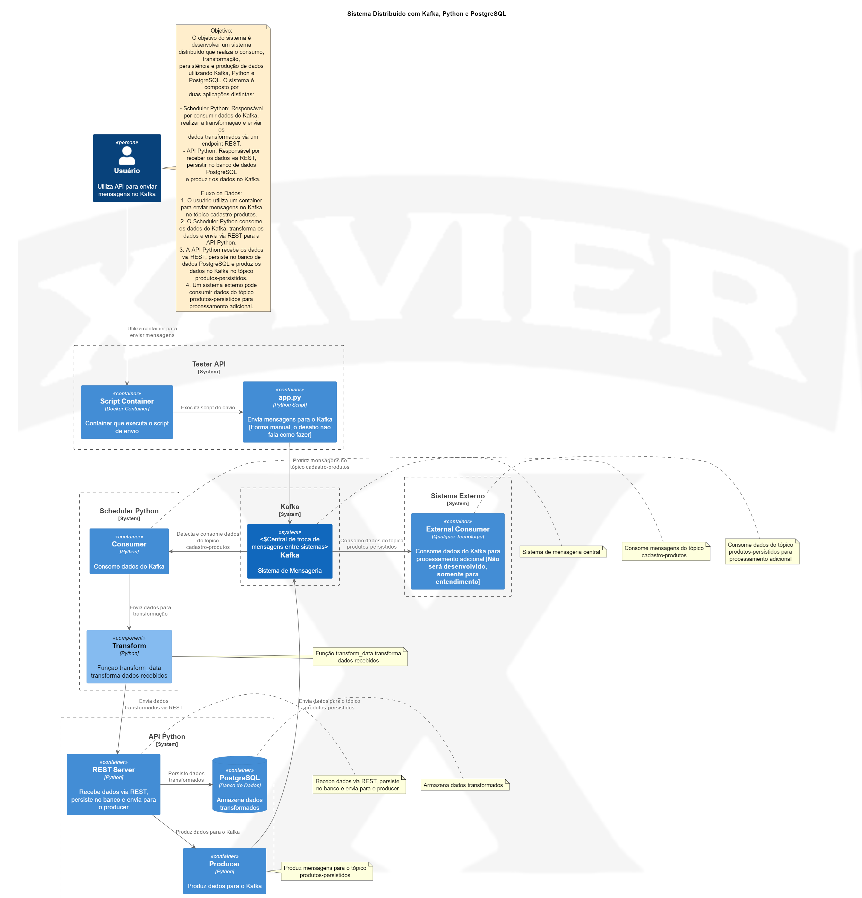

# Sistema Distribuído com Kafka, Python e PostgreSQL

Bem-vindo! Este guia irá te auxiliar a configurar e rodar um sistema distribuído utilizando Kafka, Python e PostgreSQL. Este projeto é dividido em duas partes principais: Scheduler Python e API Python. Siga os passos abaixo para colocar tudo em funcionamento.

Aqui está um diagrama do modelo C4:



Explicação em áudio do Modelo C4:

<audio controls>
  <source src="USE_P_TESTAR/ExplicandoGrafico.mp3" type="audio/mpeg">
  Seu navegador não suporta o elemento de áudio.
</audio>

## Pré-requisitos

1. **Docker:** Certifique-se de ter o Docker instalado. Este projeto foi testado utilizando o "Docker for Windows".
2. **Permissões Administrativas:** Garanta que a pasta onde o projeto será colocado tenha permissões administrativas.

## Passos para Configuração e Execução

1. **Colocando o Projeto na Pasta Correta**
   - Coloque o projeto em uma pasta com permissões administrativas.

2. **Iniciando com Docker Compose**
   - Navegue até o diretório raiz onde se encontra o arquivo `docker-compose.yml`.
   - Execute o comando abaixo para construir e iniciar os containers:
     ```sh
     docker-compose up --build
     ```
   - Aguarde cerca de 15 segundos para que todos os serviços estejam prontos.

3. **Utilizando o Postman para Testar a API**
   - Você pode importar a coleção do Postman fornecida (`Prova.postman_collection.json`) para testar as endpoints.
   - No Postman, utilize as URLs fornecidas no arquivo `Urls_para_testar.txt` para enviar e consultar dados.

4. **Testando Manualmente com HTML e CORS**
   - Caso não possa utilizar o Postman, há um arquivo HTML fornecido que pode ser usado para testar as endpoints.
   - Para permitir requisições CORS no Chrome (Windows), crie um atalho com o seguinte destino:
     ```
     "C:\Program Files\Google\Chrome\Application\chrome.exe" --disable-web-security --user-data-dir="C:\ChromeDevSession"
     ```
   - Inicie o Chrome utilizando este atalho.

## Endpoints Disponíveis para Testes

1. **Envio Manual de Dados para o Scheduler**
   - **URL:** `http://localhost:5001/api/send`
   - **Método:** POST
   - **Corpo do Request (JSON):**
     ```json
     {
       "productId": "688",
       "productName": "Produto de Test7",
       "productDescription": "Descrição do Produto de Teste",
       "price": 19.99,
       "currency": "BRL",
       "stockQuantity": 100,
       "category": "Categoria de Teste"
     }
     ```

2. **Consultar Produtos Cadastrados**
   - **URL:** `http://localhost:5001/api/cadastro-produtos`
   - **Método:** GET
   - **Exemplo de Retorno:**
     ```json
     {
       "messages": [
         {
           "category": "Categoria de Teste",
           "currency": "BRL",
           "price": 19.99,
           "productDescription": "Descrição do Produto de Teste",
           "productId": "675",
           "productName": "Produto de Test7",
           "stockQuantity": 100
         },
         {
           "category": "Categoria de Teste",
           "currency": "BRL",
           "price": 19.99,
           "productDescription": "Descrição do Produto de Teste",
           "productId": "677",
           "productName": "Produto de Test7",
           "stockQuantity": 100
         },
         {
           "category": "Categoria de Teste",
           "currency": "BRL",
           "price": 19.99,
           "productDescription": "Descrição do Produto de Teste",
           "productId": "688",
           "productName": "Produto de Test7",
           "stockQuantity": 100
         }
       ],
       "status": "success"
     }
     ```

3. **Consultar Produtos Persistidos**
   - **URL:** `http://localhost:5001/api/produtos-persistidos`
   - **Método:** GET
   - **Exemplo de Retorno:**
     ```json
     {
       "messages": [
         {
           "availability": {
             "quantity": 100,
             "timestamp": "2024-06-24T10:45:30.375475"
           },
           "category": "Categoria de Teste",
           "description": "Descrição do Produto de Teste",
           "id": "675",
           "name": "Produto de Test7",
           "pricing": {
             "amount": 19.99,
             "currency": "BRL"
           }
         },
         {
           "availability": {
             "quantity": 100,
             "timestamp": "2024-06-24T10:45:38.807542"
           },
           "category": "Categoria de Teste",
           "description": "Descrição do Produto de Teste",
           "id": "677",
           "name": "Produto de Test7",
           "pricing": {
             "amount": 19.99,
             "currency": "BRL"
           }
         },
         {
           "availability": {
             "quantity": 100,
             "timestamp": "2024-06-24T10:45:41.852964"
           },
           "category": "Categoria de Teste",
           "description": "Descrição do Produto de Teste",
           "id": "688",
           "name": "Produto de Test7",
           "pricing": {
             "amount": 19.99,
             "currency": "BRL"
           }
         }
       ],
       "status": "success"
     }
     ```

## Estrutura do Projeto

- **Scheduler Python:** Consome mensagens do Kafka, transforma os dados e os envia via um endpoint REST.
- **API Python:** Recebe os dados transformados, persiste no PostgreSQL e produz os dados para um novo tópico no Kafka.

## Arquivos e Configurações
- **docker-compose.yml:** Arquivo de configuração do Docker Compose para subir todos os serviços necessários.
- **Prova.postman_collection.json:** Coleção do Postman para facilitar os testes das APIs.
- **Urls_para_testar.txt:** Arquivo com as URLs para testes manuais.
- **Chrome_CORS.txt:** Instruções para configurar o Chrome e permitir CORS.

## Dicas Adicionais
- Para mais detalhes sobre a estrutura e funcionalidade do projeto, consulte os diagramas fornecidos.
- O projeto foi desenvolvido e testado no Windows, mas é compatível com Linux e macOS com pequenas adaptações.

Bom uso e qualquer dúvida, não hesite em consultar os arquivos e as instruções detalhadas!

---

By Anderson Xavier
